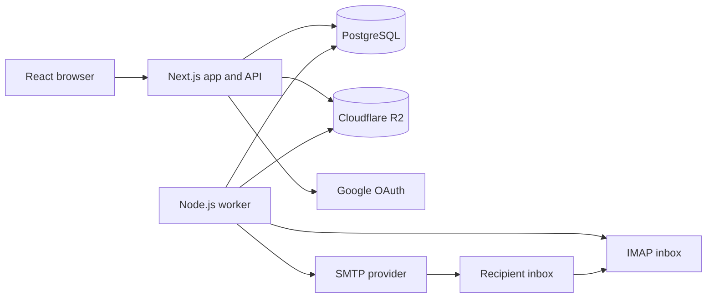

# Frost

A production-minded outreach platform for building, scheduling, and tracking personalized email campaigns.

Frost separates the fast user-facing control plane from the slow, failure-prone work of sending email and checking inboxes. The web app manages campaigns and state; a standalone worker executes scheduled delivery and stops follow-ups when a contact replies or bounces.

## What It Demonstrates

- Multi-step email sequences with per-contact scheduling
- Google OAuth and PostgreSQL-backed sessions
- CSV lead import with campaign/company/contact modeling
- Rich templates with variables such as `{{ firstName }}` and attachments
- Direct browser-to-Cloudflare R2 uploads through presigned URLs
- SMTP delivery with threaded follow-ups using `In-Reply-To` and `References`
- IMAP reply and bounce detection with automatic follow-up cancellation
- Timezone-aware sending windows and weekend preferences
- Prisma transactions for consistent campaign creation

## Architecture



The web app schedules work by writing `EmailLog` records. The worker claims due records, sends mail, records the provider message ID, schedules the next sequence step, and reacts to replies or bounces. See [overall_architecture.md](overall_architecture.md) for the design rationale and lifecycle.

## Repository Layout

- `frost-app-main/frost-app-main`: Next.js web app, API routes, auth, dashboard, Prisma schema
- `frost-worker-main/frost-worker-main`: Node.js/TypeScript email worker
- `app_flow.md`: user-facing campaign and dashboard flow
- `worker_flow.md`: worker execution flow
- `overall_architecture.md`: system design overview

## Run Locally

Requirements: Node.js 20+, PostgreSQL, Google OAuth credentials, and a Cloudflare R2 bucket.

1. Configure environment variables in each application directory. The web app validates its configuration at startup; never commit `.env` files.
2. Start the web app:

```powershell
cd frost-app-main/frost-app-main
npm install
npx prisma generate
npx prisma migrate deploy
npm run dev
```

3. In a second terminal, start the worker:

```powershell
cd frost-worker-main/frost-worker-main
npm install
npm run build
npm start
```

The web app runs at `http://localhost:3000`. Required web-app variables include `DATABASE_URL`, `GOOGLE_CLIENT_ID`, `GOOGLE_CLIENT_SECRET`, `NEXTAUTH_SECRET`, the R2 credentials, and `GEMINI_API_KEY`. The worker reads its database and storage configuration from its environment; sender SMTP/IMAP credentials are stored per user in PostgreSQL.

## Engineering Notes

The system favors explicit state transitions over hidden background behavior: campaigns, contacts, and email logs expose their lifecycle in the database. This makes the dashboard explainable, allows the worker to recover after interruption, and keeps the request path responsive while external mail services are unavailable or slow.
