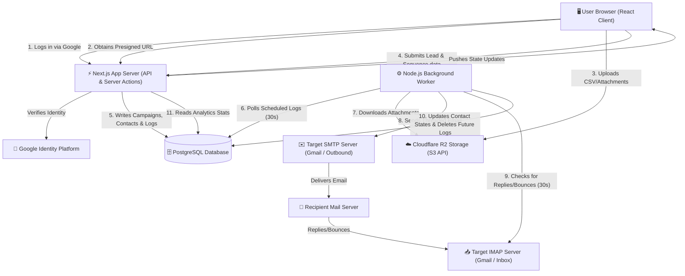

# Frost Mass Mail App - Overall System Architecture

This document provides a holistic view of the Frost Mass Mail system. It maps the relations between the frontend client, the serverless/API layer, the database, the background daemon worker, and third-party integrations (Google Auth, SMTP/IMAP servers, and Cloudflare R2).

---

## 🏗️ Architectural Topology Diagram

Here is a system-wide block diagram showing how all the components interact:

---

## 🔄 End-to-End Data Flow Lifecycle

The system operates in four distinct phases:

### Phase 1: Onboarding & SMTP/IMAP Setup
1. **User Sign-In**: The user authenticates via **Google OAuth**. A secure session cookie is generated.
2. **Settings Provisioning**: NextAuth triggers a post-creation event, seeding default configurations for Gmail SMTP/IMAP in the database.
3. **Credentials Entry**: The user navigates to Settings and enters their SMTP/IMAP credentials (e.g., App Passwords). This is saved in the `EmailSettings` table.

### Phase 2: Lead Parsing & Campaign Creation
1. **CSV Parsing**: The user uploads a lead spreadsheet on the frontend. The file is parsed locally inside the browser.
2. **Template Design & File Upload**:
   - The user writes templates in the editor.
   - For attachments, the client requests a presigned URL. The server issues a temporary URL. The browser uploads the files directly to Cloudflare R2.
3. **Draft Campaign Save**: The campaign is submitted to `/api/campaigns` as a `DRAFT`. Contacts and companies are resolved and bulk-inserted in a database transaction.

### Phase 3: Campaign Dispatch & Delay Sequencing
1. **Activation**: The user clicks "Launch". The frontend calls the campaign PATCH endpoint.
2. **First Log Creation**: The server calculates the target sending time based on preferences (e.g., send tomorrow at 09:00, avoiding weekends) and inserts the first step as a `SCHEDULED` `EmailLog`.
3. **Worker Processing Loop**:
   - The background worker polls the database for scheduled logs that are past their target time.
   - The worker downloads attachments from Cloudflare R2.
   - It performs variable substitution (`{{ firstName }}`) on the text.
   - It establishes an SMTP connection and dispatches the email.
   - It updates the database log status to `SENT`.
4. **Follow-Up Scheduling**: The worker instantly reads if there is a next step in the campaign sequence. If step 2 has a delay of 3 days, it creates a new `SCHEDULED` `EmailLog` marked for 3 days in the future.

### Phase 4: Threaded Replies & Bounce Control
1. **Threading**: When sending step 2, 3, etc., the worker fetches the `messageId` of step 1. It sets the `In-Reply-To` and `References` headers and prefixes the subject with `Re: `.
2. **IMAP Scanning**: Every 30 seconds, the worker logs into the sender's IMAP inbox.
3. **Bounce Detection**: If a bounce email is parsed, the worker locates the contact, marks their status as `BOUNCED`, and deletes all scheduled future logs.
4. **Reply Detection**: If the recipient replies:
   - The worker matches the email to a contact via the `In-Reply-To` header or sender address.
   - Marks the contact status as `REPLIED`.
   - Deletes all scheduled future logs so the user does not receive automated follow-ups.
   - If "stop all company mails on reply" is enabled, all other contacts under that same company in this campaign are marked `STOPPED` and their logs are deleted.

---

## ⚡ Key Architectural Patterns

### 1. Decoupled Web and Background Services
- **Problem**: Sending emails and parsing email inboxes via IMAP are slow network tasks that can take seconds to complete. If done within Next.js API routes, it would exceed serverless function timeouts (usually 10–30s) and freeze the web UI.
- **Solution**: The frontend only writes to the database. The background worker runs as a separate, independent system. This decouples user experience from network latency and ensures the UI remains highly responsive.

### 2. Transaction Safety
- All modifications to campaign structures, contact lists, and sequence chains are wrapped in database transactions (`prisma.$transaction`). This prevents partial saves (e.g., creating a campaign record but failing to save its leads), keeping the database schema fully consistent.

### 3. Presigned Cloud Storage Uploads
- Direct client-to-R2 uploads mean the Next.js server does not have to receive, store, or forward file buffers. This dramatically reduces memory and CPU load, ensuring the frontend scales efficiently even when multiple users upload large PDF or image attachments simultaneously.
